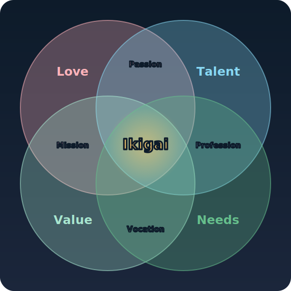
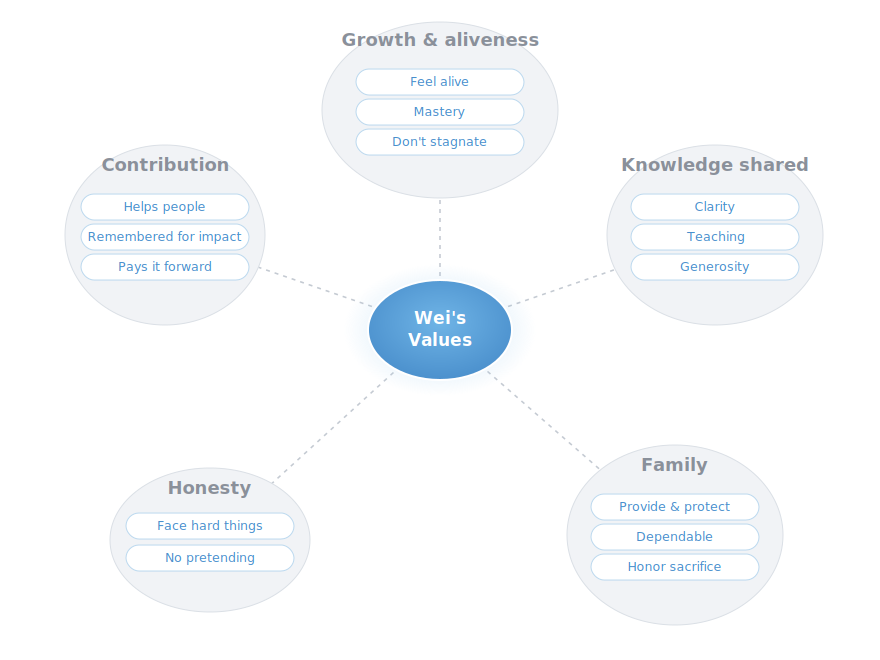

# Ikigai Finder

**Point your AI agent at this repo and walk through a complete Ikigai journey — discover not just *what* your true calling is, but the concrete *means* to live it.**

This is an **agent-native** package. There's no app to install and no model to run. The "program" is a set of instructions written for an AI agent (Claude Code, Cursor, ChatGPT, Gemini, or any capable assistant). The agent reads this repo, becomes your guide, and runs the journey *as a conversation* — at your pace, in your language.

It's a faithful, open-source encoding of Jinpei Yagi's **self-understanding method** for finding what you want to do — a Japanese bestseller. The repo is written in English; your agent runs the journey in whatever language you speak. See [Attribution](#attribution).

---

## What is Ikigai?

*Ikigai* is a Japanese idea that translates, roughly, as "a reason to get up in the morning" — the thing that makes a life feel worth living. It's often pictured as the overlap of four circles:



- **Love** + **Talent** → your **Passion**
- **Love** + **Value** → your **Mission**
- **Talent** + **Needs** → your **Profession**
- **Value** + **Needs** → your **Vocation**
- where all four meet → your **Ikigai**

That's the familiar picture. *Finding* yours is the hard part — and that's what this repo does. It runs **Jinpei Yagi's self-understanding method**, which works from the inside out: investigate the three things you can actually know about yourself — **what you love, what you're good at, and what you value** — to name your true calling (stated as an activity, with no job title), then find the **means** to live it out in the world. Your calling is found inside you; the means are found outside, where your gifts meet what the world needs.

---

## What you get

By the end you'll have, written down:

1. **Your three pillars** — what you value, what you're good at, and what you love.
2. **Your Work Purpose** — the outward impact you want to have on others (the *Why*).
3. **Your True Calling** — `What you love × How you naturally work × Why` — stated as an *activity*, never a job title.
4. **Your Means** — concrete careers, projects, and weekly practices that *realize* the calling. This is the part most "find your purpose" exercises skip. Your calling lives inside you; the means live out in the world.

---

## You can watch every step

This isn't a black box that hands down a verdict. The agent **reveals its reasoning as it goes** — how your answers become keywords, keywords become values, love × talent become candidates, and which candidates the Work Purpose *keeps or drops, and why* — and **draws what it builds** at each stage. You see yourself take shape, and you can correct any move.

Here's the values mind map from a real run (the [AI-era engineer walkthrough](examples/walkthrough-fast-ai-engineer.md)):



Every stage ends in a picture like this; the synthesis step even diagrams the *formula* — which candidates survived the filter and which were set aside. How it's done: [`method/visuals.md`](method/visuals.md).

---

## How to use it

### Option A — an agent with file access (Claude Code, Cursor, Cline, etc.)

Clone the repo and just ask:

```
git clone https://github.com/daocoding/ikigai-finder.git
cd ikigai-finder
```

Then, in your agent:

> "Read AGENTS.md and guide me through the Ikigai journey."

The agent reads [AGENTS.md](AGENTS.md) — its operating manual — and takes it from there. It will ask whether you want the **fast** or **full** version, then run the whole thing.

### Option B — a chat assistant with no file access (ChatGPT, Claude.ai, Gemini app)

Copy the contents of [`prompt/system-prompt.md`](prompt/system-prompt.md) into a new conversation as your first message. That single file is a self-contained version of the journey. Then say "let's begin."

---

## Fast vs. Full

| | **Fast** | **Full** |
|---|---|---|
| Questions | 5 per pillar (15 total) | 30 per pillar (90) + 8-angle deep-dive on your top talent |
| Time | ~15 minutes | ~45–60 minutes |
| Best for | A first pass; a busy day; re-running periodically | The real thing — do this once, properly |

Both end with the **same** synthesis and **Means** steps. Fast is a sketch; Full is the portrait.

---

## What's in here

```
AGENTS.md            ← The agent's operating manual. Start here.
prompt/
  system-prompt.md   ← Copy-paste version for chat assistants with no file access.
method/
  00-overview.md     ← The framework: 3 pillars, the two formulas, the means.
  01-values.md       ← Values → Work Purpose (Why). Includes "trap value" probing.
  02-talents.md      ← Talents (How). The ◎ / ○ / △ rating + 8-angle deep dive.
  03-love.md         ← Love (What). Domains that pull you.
  04-synthesis.md    ← Two-step synthesis → your True Calling.
  05-means.md        ← Practical paths to live it (careers welcome here).
  misconceptions.md  ← The 5 myths to drop before you start.
  visuals.md         ← How to reveal each step + render diagrams (Mermaid / SVG).
questionnaires/
  fast.md            ← 15 questions.
  full.md            ← 90 questions + 8 angles.
reference/
  values-100.md      ← The 100 official values + trap values.
  talents-100.md     ← The 100 talents, each with its strength & shadow.
  interests-100.md   ← 100 interest domains, grouped.
templates/
  ikigai-result.md   ← The summary the agent fills in for you at the end.
examples/
  walkthrough-fast.md             ← A short sample run so you can see the shape.
  walkthrough-fast-ai-engineer.md ← A fuller run: a mid-career engineer in the AI era.
assets/
  ikigai.svg                      ← The diagram above — the Ikigai Venn (matches the BECoach app).
  templates/mindmap.svg           ← Fillable mind-map keepsake (values / talents / love).
  examples/values-mindmap-example.svg ← Example rendered values mind map.
```

---

## Design principle

One method, many agents. Rather than ship a bespoke app for each platform, this repo encodes the *process* once, in plain Markdown, so **any** sufficiently capable agent can run it. The substrate is portable; your agent is the runtime.

---

## Attribution

The methodology, the question sets, and the official Values / Talents / Interests lists are derived from:

> **Jinpei Yagi** — his *self-understanding method* for finding what you want to do, from his 2020 Japanese bestseller (KADOKAWA). Translated into many languages, including a widely-read Chinese edition.

This repository is an independent, non-commercial, educational re-encoding of that method for use by AI agents. **The method and its frameworks are the intellectual property of the author.** If this helps you, please [buy the book](https://www.amazon.co.jp/dp/4046043636) — it is the source, and it goes deeper than any summary can.

The **code and orchestration in this repo** (the agent instructions, structure, and templates) are released under the [MIT License](LICENSE). The **underlying methodology** is not ours to license — it is credited above.

Built by [Daocoding](https://github.com/daocoding). Extracted from the BECoach on-device coaching app.
