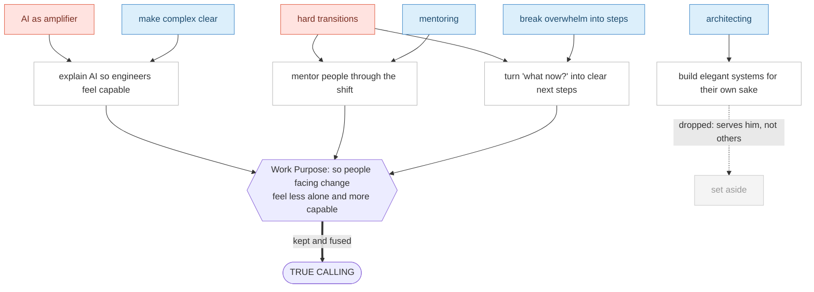

# Example — fast-track run: a mid-career engineer in the AI era

A complete simulated **fast** journey (15 questions), run by an agent following [`../AGENTS.md`](../AGENTS.md). Persona played for the answers: **Wei Chen**, 36, born in Chengdu, came to the US at 24 for a CS master's, now 10 years a backend/platform engineer (currently senior SWE at a Seattle fintech). Married, one 4-year-old. Quietly anxious that LLMs now write the code he built his identity on — wondering what's worth doing in the AI era.

> Unlike the trimmed [walkthrough-fast.md](walkthrough-fast.md), this is shown closer to full length so you can see the method actually working — the trap-value probe, the ◎/○/△ ratings, the two-step synthesis, and the calling-vs-means split. The guide asks one question at a time and reflects back; trimmed only lightly.

---

## Step 0 — setup

**Guide:** Before we start — want the **fast** version (~15 min, 5 questions per area) or the **full** one (~45 min)? And shall I show you the 5 common myths about "finding what you want to do" first?

**Wei:** Fast, please. Skip the myths — I've got 20 minutes before my kid wakes up.

**Guide:** Perfect. We'll go through three areas — what you value, what you're good at, what you love — then I'll pull them together into a direction and concrete next steps. One question at a time. Ready when you are.

---

## Stage 1 — Values → Work Purpose

**Guide:** Who do you respect — a friend, a public figure, a character — and what *specifically* about them?

**Wei:** My father. High school physics teacher in Chengdu, never made much money — but former students still visit him 30 years later. I respect that he made people's lives better and they *remembered* him for it. Also Andrej Karpathy — not for the fame, but how he explains hard things so clearly that anyone can suddenly get it.

*Guide notes: respect is anchored on **lasting impact on people** + **making the hard things clear**. Not status, not wealth.*

**Guide:** Both of those are about lifting other people — one through care over time, one through clarity. Next: what experience in your childhood or youth shaped you most, and how did it shape your values?

**Wei:** We didn't have much. My parents saved everything for my education. Getting into a good university felt like the whole family's years of sacrifice paying off. It taught me two things — education is the lever that changes a family's whole trajectory, and someone quietly sacrificing for you is the deepest kind of love.

*Guide notes: **education-as-lever**, **quiet sacrifice / family**, not wasting a gift.*

**Guide:** So opportunity, and a debt you want to honor. What do you feel is missing or wrong in society today?

**Wei:** People are isolated and anxious — immigrants especially. Everyone's grinding and nobody feels seen. And right now with AI, a lot of engineers my age are scared and pretending they're fine. There's no honest place to figure out "okay… what now?"

*Guide notes: anger/ache points at a domain he cares about — **honest help for people facing a scary transition**, esp. immigrants & mid-career engineers.*

**Guide:** Ask your wife, or imagine her answer: what does she think you value most in life?

**Wei:** She'd say "being dependable" — that people can count on me, that I won't let my family down. She'd also say I overvalue *security* sometimes.

*Guide notes: "security" is a possible **trap value** — probe it.*

**Guide:** Let me gently push on "security," because it's often a stand-in for something deeper. When you imagine having total security — what does it actually let you *do* or *feel*?

**Wei:** …Honestly? It's not about me feeling safe. It's that I can take care of the people who took care of me — my parents, my wife, my kid. And maybe, if I'm secure enough, I'd finally have room to do something that *matters* instead of just something safe.

**Guide:** That's important — so "security" isn't the value, it's the gate. Underneath it are **providing for the people you love** and a held-back wish for **work that matters**. Last values question: advising your daughter, what's the #1 thing you'd most want to tell her — and what would you most *not* want to tell her?

**Wei:** I'd most want to tell her: "Find what makes you feel alive, and get so good at it that you can help other people with it." What I'd *not* want to tell her — and this stings — is "just pick something safe and stable." Because that's basically what I did, and part of me regrets it.

*Guide notes: he just rejected his own trap value out loud. His real hierarchy is clear.*

**Guide:** That's one of the most honest things people say in this whole exercise. Here's what I'm hearing as your top values — tell me if a word is off:

1. **Contribution** — being someone whose work genuinely helps people (your dad, the engineer who saved you)
2. **Growth / aliveness** — "feel alive and get so good you can help others"; not stagnating
3. **Knowledge shared** — clarity, teaching, paying forward what you were given
4. **Family** — providing for the people who sacrificed for you
5. **Honesty** — an honest place to face hard things, no pretending

**Wei:** Yeah. That's me — and seeing "security" *not* in the top 5 is uncomfortable but right.

**Guide → Work Purpose (the *Why*):**
> *"So people facing a frightening change feel less alone — and more capable of their next step."*

**Wei:** …that actually gave me chills. Yes.

**Guide:** Here are your values as a map — your own words, clustered. Move anything that's off?

**Wei:** No — that's me on one page.

---

## Stage 2 — Talents (rated ◎ proven+energizing · ○ energizing · △ unsure)

**Guide:** In your life so far, what experience felt the most fulfilling?

**Wei:** I rewrote a deployment system everyone was scared of. But the part I loved wasn't the code — it was three junior engineers telling me they *finally* understood how the whole system worked, because I'd documented it and walked them through it. I made something complex feel approachable.

→ **◎ Making the complex approachable** (proven: system shipped *and* people learned). *Shadow: can over-explain; slow to ship his own ideas.*

**Guide:** What's recently made you irritated or anxious?

**Wei:** Watching sharp colleagues panic about AI and either freeze or pretend they're fine. And my own fear that the thing I'm good at is becoming a commodity. It bugs me that nobody talks about it honestly.

→ **○ Sensing what people are really feeling** (esp. hidden fear) — emerging talent, and a clue to his domain.

**Guide:** Ask your wife — what does she say your strengths are?

**Wei:** Patience. She says I'm who friends call when they're overwhelmed, because I break their problem into steps until they calm down. And that I explain technical things to non-technical people without making them feel dumb.

→ **◎ Breaking overwhelm into clear next steps** · **◎ Explaining without condescension.** Both proven, both energizing.

**Guide:** If you quit tomorrow, what would you miss?

**Wei:** Not the meetings. I'd miss mentoring the junior devs — that moment when someone *gets it*. And solving a gnarly architecture problem with a small team I trust.

→ **◎ Mentoring / the "they get it" moment** · **○ Architecting hard system problems.**

**Guide:** What results have you achieved, and *exactly how*?

**Wei:** Led a monolith-to-services migration, on time, no major outage. How? I didn't just design it — I wrote a clear plan and taught everyone so they could move *without me in the room*. The teaching is why it worked.

→ Confirms the **core mechanism: systematize + teach so others can act without him.**

**Guide:** Your talent pattern is unusually consistent: **◎** make-the-complex-approachable, **◎** break-overwhelm-into-steps, **◎** explain-without-condescension, **◎** mentoring, with **○** architecting and **○** reading-people's-fear. The thread through all of them isn't "writing code" — it's *making other people capable.* Sound right?

**Wei:** …I've never said it that way, but yes. The code was never the point. Huh.

---

## Stage 3 — Love (domains that pull him; 🔥 = hot)

**Guide:** What would you happily pay to study right now?

**Wei:** How people actually learn and change — cognitive science, how adults reskill. And the practical side of AI — not to keep up out of fear, but how it can *amplify* a person instead of replacing them. 🔥

**Guide:** What's on your bookshelf?

**Wei:** Tech books. But the ones I *reread*: The Pragmatic Programmer, Cal Newport, a couple on teaching, and a worn copy of Zeng Guofan's letters my dad gave me — about steady character and self-cultivation.

→ domains: **craft/mastery**, **deep work**, **teaching**, **character/self-cultivation**, a bicultural thread.

**Guide:** Anything that ever made you feel "this saved me"?

**Wei:** When I first immigrated and was drowning, a senior engineer — also an immigrant — took time to explain not just the code but how to *survive* here. That mentorship saved me. I've wanted to be that for someone ever since. 🔥

**Guide:** Whose work do you want to thank?

**Wei:** That engineer. My parents. And the strangers who write clear tutorials at 2am that got me unstuck — never met them, but they shaped my career.

**Guide:** What social issue makes you angry?

**Wei:** That talented immigrants get stuck because nobody shows them the unwritten rules. And that mid-career people are told they're "obsolete" in the AI shift instead of being *helped to adapt*. It's wasteful and cruel. 🔥

**Guide:** Your hot domains: **how people learn & change**, **mentoring people through a hard transition** (immigrants, mid-career engineers), **AI-as-amplifier-not-replacement** — wrapped in a value of craft and character. These aren't random; they're all the same shape.

---

## Stage 4 — Synthesis

**Step 1 — candidates (Love × Talent), quantity over quality, no job titles:**

1. Explaining AI in plain terms so anxious engineers feel *capable* instead of obsolete
2. Mentoring immigrant engineers through the unwritten rules of surviving and thriving in US tech
3. Breaking the scary "what do I do now?" of the AI era into clear, doable next steps
4. Writing calm, clear guides that get someone unstuck at 2am
5. Designing learning that helps people actually *change*, not just consume information
6. Turning complex systems into mental models other people can build on
7. Hosting honest rooms where engineers admit their AI fear and find their footing

**Step 2 — filter through his Work Purpose** ("so people facing a frightening change feel less alone and more capable of their next step"). Here's the logic in one picture — his love × talent pairings became candidates, then the Work Purpose kept some and set others aside:

Candidates 1, 2, 3 (and 7) serve the purpose and fuse; "architecting for its own sake" gets set aside — visibly, with the reason. That gives:

> ### Wei's true calling (a hypothesis, not a verdict)
> **"Turning the fear of a big change into clear, doable next steps — for engineers and immigrants facing the AI shift — so they feel less alone and more capable of who they're becoming."**
>
> *Method:* make the complex approachable + break overwhelm into steps + mentor · *Domain:* the AI-era career transition (esp. immigrants & mid-career engineers) · *Why:* less alone, more capable.

**Guide:** This is a starting point you test by living it, not a label. Quick 3-axis check — does any part feel off on your **values**, your **talent**, or your **love**?

**Wei:** No… all three light up. The strange part is it uses the AI thing I've been *afraid* of as the raw material. That reframes my fear into my material.

---

## Stage 5 — Means (now job titles are welcome)

| Means | What it looks like | Why it fits | First step (this week) | Timeframe |
|---|---|---|---|---|
| **AI-enablement / developer-education lead** (or Dev Advocate) | Teach teams to use AI tools well; write the internal playbooks; run workshops | Clarity + teaching + "amplify not replace" — directly | Offer to run one lunch-and-learn: "Using AI to amplify, not replace, your work" | short–medium |
| **Write for immigrant + mid-career engineers** (newsletter / small community) | Honest posts on the unwritten rules + navigating the AI shift | Pays forward the mentorship that saved him; transition domain | Write one 800-word post, "What now? — for engineers scared of AI," send to 10 ex-colleagues | **this week** |
| **Engineering manager / lead, coaching-heavy** | Grow people, not just ship; the mentoring he'd miss | Mentoring ◎ + dependable + contribution | Tell his manager he wants to formally mentor 2 juniors / explore the lead track | medium |
| **A small course or tool for AI-era reskilling** | Build the thing that helps mid-career devs adapt | Systematize + teach + "do something that matters" (answers the regret) | Outline a 5-lesson mini-course; interview 5 potential learners | medium–long |

**Daily practices:** (1) spend 15 min explaining one AI concept simply — a short note or tweet. (2) Message one person facing a transition and offer one concrete next step.
**Weekly ritual:** Friday, write 300 words unpacking something you learned that week, for the "scared engineer" reader.

**Guide:** Of all of that — what's the one step you'll actually take this week?

**Wei:** Write the post. "What now? — for engineers scared of AI." Send it to ten people. If even one replies "this helped," I'll know.

**Guide:** That's it. That post *is* your calling in miniature — clarity, for people in a scary transition, so they feel less alone. Want me to check in Friday on how it landed?

---

## Filled result (the keepsake)

- **Values:** Contribution · Growth/aliveness · Knowledge shared · Family · Honesty
- **Talents:** ◎ make-complex-approachable · ◎ break-overwhelm-into-steps · ◎ explain-without-condescension · ◎ mentoring · ○ architecting · ○ reading hidden fear — *core mechanism: systematize + teach so others can act without me*
- **Love:** how people learn & change 🔥 · mentoring people through hard transitions 🔥 · AI-as-amplifier 🔥 · craft & character
- **Work Purpose:** So people facing a frightening change feel less alone and more capable of their next step.
- **True Calling:** Turning the fear of a big change into clear, doable next steps — for engineers and immigrants facing the AI shift — so they feel less alone and more capable of who they're becoming.
- **First step this week:** Write & send "What now? — for engineers scared of AI" to 10 people.

---

## Builder's verdict — does the repo work?

**Yes — it produced a coherent, personalized, on-method journey from cold start, and the AI-era framing emerged naturally rather than being forced.** What the run confirms:

- **The trap-value probe earned its place.** "Security" was his stated value; one probe ("what does it actually let you do?") cracked it open into *provide for family* + *do work that matters*, and his own "advice to my daughter" answer then disqualified security from the top 5. Without that step, the whole synthesis would have aimed at the wrong target (a safe job) instead of his real one.
- **The two-step synthesis matters.** Generating 7 loose candidates first, *then* filtering by Work Purpose, kept the calling from collapsing into "AI developer advocate" (a job title). The calling stayed an *activity*; the job titles correctly waited for the Means table.
- **Cross-pillar threading is what makes it feel personal.** The "senior immigrant engineer who saved me" (Love) ↔ "mentoring is what I'd miss" (Talent) ↔ "being remembered for helping" (Value) all reinforced one shape. `AGENTS.md`'s "keep the thread" instruction did real work; an agent that treated each pillar in isolation would produce a blander result.
- **The AI-era anxiety became raw material, not noise.** The method is domain-agnostic, so "ikigai in the AI era" just flowed in through his Love/anger answers and out through AI-relevant Means. His fear got reframed *as his material* — arguably the single most valuable moment, and it came from the method, not from me improvising.

**Honest gaps / notes:**
- **Fast track is a sketch.** 5 questions/pillar was enough for a strong direction, but the talent layer would deepen a lot with the **full** track's 8-angle dive (e.g., *exactly* how he makes things approachable). For a real decision he'd want the full run.
- **Quality depends on the guiding model.** A weaker agent might skip the trap-probe or let a job title sneak into the calling. The rules in `AGENTS.md` are clear, but they're instructions, not guardrails — worth watching when other agents run it.
- **Self-answered persona caveat.** I played both sides, so the answers were unusually articulate and self-consistent. A real human rambles, contradicts, and needs more reflecting-back. The flow handles that (it's a conversation), but a live run will be messier and slower.

**Net:** the substrate holds. An agent pointed at this repo can take a stranger from "I'm scared AI makes me obsolete" to a named calling and a concrete first step in ~15 minutes, faithfully to Jinpei Yagi's method.
