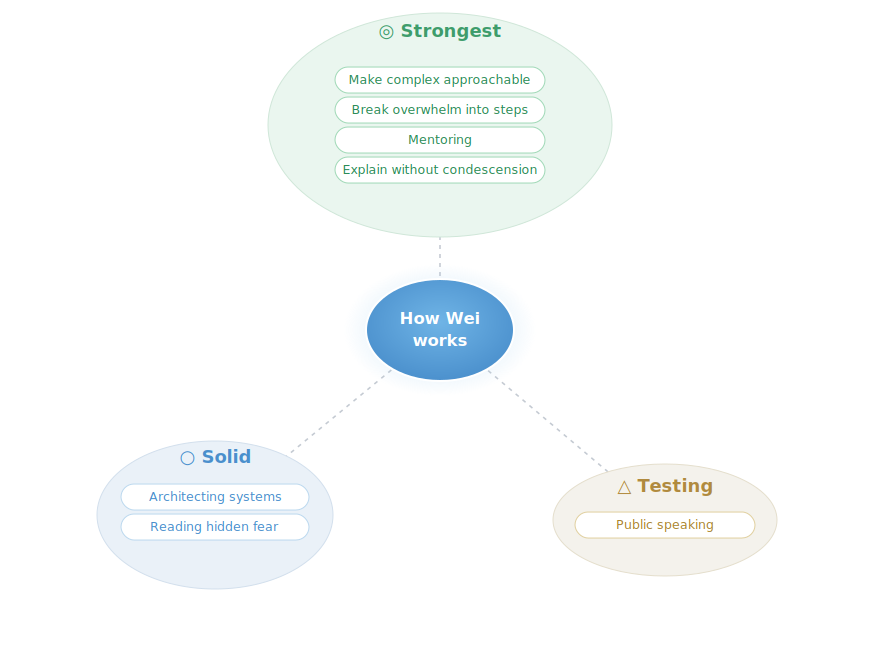
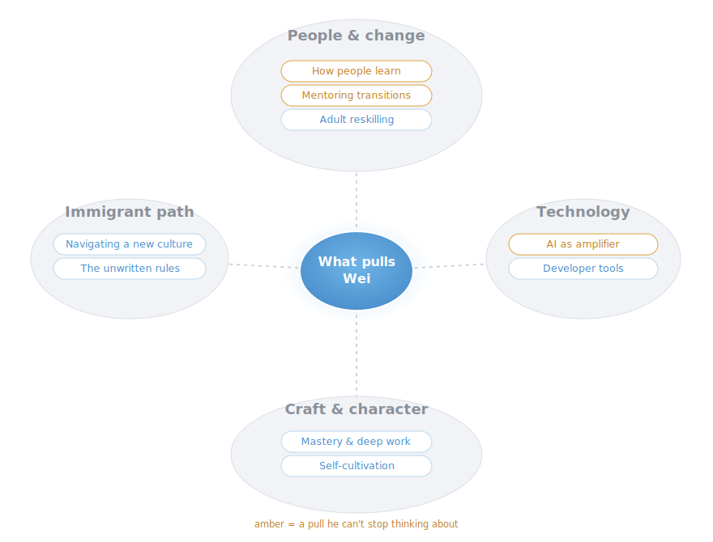

# Example — fast-track run, fully annotated: a mid-career engineer in the AI era

A complete **fast** journey (15 questions) run by an agent following [`../AGENTS.md`](../AGENTS.md), shown with **every step exposed**: each question, the user's full answer, and the **keyword extraction** for that answer — phrase → keyword → where it maps. Nothing is hidden; you can audit how each answer becomes a value, a talent, a domain, and finally a calling.

Persona played for the answers: **Wei Chen**, 36, born in Chengdu, came to the US at 24 for a CS master's, now 10 years a backend/platform engineer (senior SWE at a Seattle fintech). Married, one 4-year-old. Quietly anxious that LLMs now write the code he built his identity on.

> Format of each turn: **Q** (the question) → **Wei** (his answer) → **🔍 Extraction** (the phrases the agent lifted, the keyword each becomes, and what it maps to — including *anti-signals*, where he rules something out).

---

## Step 0 — setup

**Guide:** Fast (~15 min, 5 questions per area) or full (~45)? And want the 5 myths first?
**Wei:** Fast. Skip the myths — I've got about 20 minutes.
**Guide:** We'll do three areas — what you value, what you're good at, what you love — then pull them together. One question at a time.

---

## Stage 1 — Values

**Q1.** Who do you respect — a friend, public figure, or character — and what *specifically* about them?

**Wei:** My father, first. He was a high-school physics teacher in Chengdu — never made much money, but former students still visit him thirty years later. What I respect is that he genuinely changed people's lives and they *remembered* him for it. The other is Andrej Karpathy — not because he's famous, but because he can take something genuinely hard and explain it so cleanly that suddenly anyone can follow.

**🔍 Extraction**
| Phrase from the answer | Keyword | Maps to |
|---|---|---|
| "changed people's lives… they remembered him" | lasting impact on people | **Contribution** |
| "students still visit him 30 years later" | being valued over time, not money | **Contribution** (over Wealth) |
| "explain it so cleanly anyone can follow" | clarity / teaching | **Knowledge shared** |
| "not because he's famous" | *rules out status* | anti-signal → **not** Fame |

**Q2.** What experience in your childhood or youth shaped you most, and how did it shape your values?

**Wei:** We didn't have much money. My parents put everything into my education — I found out later my mother sold her jewelry the year I applied to university. Getting in felt like the whole family's sacrifice paying off at once. It taught me two things: education is the lever that changes a family's whole trajectory, and someone quietly sacrificing for you is the deepest kind of love there is.

**🔍 Extraction**
| Phrase from the answer | Keyword | Maps to |
|---|---|---|
| "education is the lever that changes a family's trajectory" | education as the thing that lifts people | **Knowledge shared** + **Growth** |
| "whole family's sacrifice paying off" | honoring others' sacrifice | **Family** |
| "quietly sacrificing for you is the deepest love" | quiet devotion to family | **Family** |

**Q3.** What do you feel is missing or wrong in society today?

**Wei:** People are isolated and anxious — immigrants especially. Everyone's grinding and no one feels *seen*. And right now in tech, a lot of engineers my age are scared about AI and just… pretending they're fine. There's no honest place to stand and figure out "okay, what now?"

**🔍 Extraction**
| Phrase from the answer | Keyword | Maps to |
|---|---|---|
| "no one feels seen" | people being unseen bothers him | **Contribution** (make people feel seen) |
| "pretending they're fine… no honest place" | dishonesty/avoidance bothers him | **Honesty** |
| "scared about AI… what now?" | (domain signal — carry to Stage 3) | → *transition / AI shift* |

**Q4.** Ask someone close to you — what would your wife say you value most?

**Wei:** She'd say "being dependable" — that people can count on me and I won't let my family down. She'd probably also say, with a bit of an eyebrow, that I *overvalue* security.

**🔍 Extraction**
| Phrase from the answer | Keyword | Maps to |
|---|---|---|
| "people can count on me" | dependability | **Responsibility / Family** |
| "won't let my family down" | protecting family | **Family** |
| "overvalue security" | ⚠ possible **trap value** | flag → probe before trusting it |

> **Trap-value probe (shown in full):**
> **Guide:** "Security" is often a stand-in for something deeper. When you imagine total security — what does it actually let you *do* or *feel*?
> **Wei:** Honestly? It's not about me feeling safe. It's that I could take care of the people who took care of me — and maybe finally have room to do something that *matters* instead of just something safe.
> **🔍 Extraction (post-probe):** "security" → *not a core value*; it resolves into **Family** (provide for them) + a held-back **Growth / do work that matters**. The surface word is dropped; the two values underneath are kept.

**Q5.** Advising your daughter — the #1 thing you'd most want to tell her, and what you'd most *not* want to tell her?

**Wei:** I'd most want to tell her: "Find what makes you feel alive, and get so good at it that you can help other people with it." What I'd *not* want to tell her — and this one stings — is "just pick something safe and stable." Because that's basically what I did, and part of me regrets it.

**🔍 Extraction**
| Phrase from the answer | Keyword | Maps to |
|---|---|---|
| "find what makes you feel alive" | aliveness | **Growth** |
| "get so good you can help others" | mastery in service of others | **Growth** + **Contribution** |
| "*not* 'pick something safe'" | actively rejects safety-first | confirms **security is not** a top value |

### Tally → ranked top 5 (the ranking logic, in the open)

Counting how often each value was hit across the 5 answers (and weighting the ones he stated most forcefully):

| Value | Hits | Evidence |
|---|---|---|
| **Contribution** | 4 | Q1 ×2, Q3, Q5 |
| **Family** | 4 | Q2 ×2, Q4, probe |
| **Knowledge shared** | 3 | Q1, Q2, (his whole respect-pattern) |
| **Growth / aliveness** | 3 | Q2, Q5 ×2, the probe's "work that matters" |
| **Honesty** | 1 | Q3 (but stated as a near-moral line) |

**Guide:** If you could keep only three, which survive?
**Wei:** Contribution, Growth, and… Knowledge shared. Family is bedrock, but it's *why* I'd do those, not the work itself.

**Ranked:** 1) Contribution · 2) Growth · 3) Knowledge shared · 4) Family · 5) Honesty. (Security, his stated value, is deliberately *not* here — the probe and Q5 disqualified it.)

**Work Purpose (derived from the top values):**
> *"So people facing a frightening change feel less alone — and more capable of their next step."*

**Wei:** …that actually gave me chills. Yes.

**Guide:** Here are your values as a map — your own words, clustered. Move anything that's off?

**Wei:** No — that's me on one page.

---

## Stage 2 — Talents

*(Here the "keyword" is the talent under the story, plus the ◎/○/△ rating and its reason.)*

**Q1.** What experience in your life so far felt the most fulfilling?

**Wei:** I rewrote a deployment system everyone on the team was scared of. But the part I loved wasn't the code — it was that afterward, three junior engineers told me they *finally* understood how the whole system worked, because I'd documented it and walked them through it.

**🔍 Extraction**
| Phrase from the answer | Talent | Rating + why |
|---|---|---|
| "made… they finally understood" | making the complex approachable | **◎** — energized him AND shipped a result |
| "documented it and walked them through" | teaching / explaining | ◎ (same evidence) |
| "the part I loved wasn't the code" | *anti-signal* | pure-coding is **not** his energy source |

**Q2.** What's recently made you irritated, restless, or anxious?

**Wei:** Watching sharp colleagues panic about AI and either freeze or pretend they're fine. And my own fear that the thing I'm good at is becoming a commodity. It bugs me that nobody talks about it honestly.

**🔍 Extraction**
| Phrase from the answer | Talent | Rating + why |
|---|---|---|
| "watching colleagues panic… freeze… pretend" | noticing what people really feel | **○** — he reads hidden states; not yet "proven" |
| "nobody talks about it honestly" | (echoes **Honesty** value) | cross-pillar thread |

**Q3.** Ask your wife — what does she say your strengths are?

**Wei:** Patience. She says I'm the person friends call when they're overwhelmed, because I break their problem into steps until they calm down. And that I explain technical things to non-technical people without making them feel dumb.

**🔍 Extraction**
| Phrase from the answer | Talent | Rating + why |
|---|---|---|
| "break their problem into steps until they calm down" | breaking overwhelm into steps | **◎** — repeatable, others rely on it |
| "without making them feel dumb" | explaining without condescension | **◎** — a distinct, named gift |

**Q4.** If you quit tomorrow, what would you miss?

**Wei:** Not the meetings. I'd miss mentoring the junior devs — that moment when someone *gets it*. And solving a gnarly architecture problem with a small team I trust.

**🔍 Extraction**
| Phrase from the answer | Talent | Rating + why |
|---|---|---|
| "mentoring… the moment someone gets it" | mentoring | **◎** — it's what he'd *grieve losing* |
| "solving a gnarly architecture problem" | architecting hard systems | **○** — real, but secondary to the teaching |

**Q5.** What results have you achieved, and *exactly how*?

**Wei:** Led a monolith-to-services migration — on time, no major outage. How? I didn't just design it. I wrote a clear plan and taught everyone so they could move *without me in the room*. The teaching is why it worked.

**🔍 Extraction**
| Phrase from the answer | Talent | Rating + why |
|---|---|---|
| "taught everyone so they could move without me" | systematize + teach so others act | confirms the ◎ cluster — it's his *method*, not a one-off |

**Pattern revealed:** every ◎ is a variant of one thing — *making other people capable.* The code was never the point.

---

## Stage 3 — Love

*(Here the "keyword" is the field/domain, plus an intensity read: 🔥 = can't-not-think-about-it.)*

**Q1.** What would you happily pay money to study right now?

**Wei:** How people actually learn and change — cognitive science, how adults reskill. And the practical side of AI — not to keep up out of fear, but how it can *amplify* a person instead of replacing them.

**🔍 Extraction**
| Phrase from the answer | Domain | Intensity |
|---|---|---|
| "how people learn and change… how adults reskill" | how people learn | 🔥 |
| "AI… amplify a person instead of replacing them" | AI as amplifier | 🔥 |

**Q2.** What kinds of books are on your bookshelf?

**Wei:** Tech books, sure. But the ones I *reread*: The Pragmatic Programmer, Cal Newport, a couple on teaching, and a worn copy of Zeng Guofan's letters my dad gave me — about steady character and self-cultivation.

**🔍 Extraction**
| Phrase from the answer | Domain | Intensity |
|---|---|---|
| "Cal Newport / craft / deep work" | mastery & deep work | warm |
| "Zeng Guofan's letters… self-cultivation" | character / self-cultivation | warm |
| "a couple on teaching" | teaching | warm (reinforces Stage 2) |

**Q3.** Anything that ever made you feel "this saved me"?

**Wei:** When I first immigrated and was drowning, a senior engineer — also an immigrant — took time to explain not just the code but how to *survive* here. That mentorship saved me. I've wanted to be that for someone ever since.

**🔍 Extraction**
| Phrase from the answer | Domain | Intensity |
|---|---|---|
| "mentorship… how to survive here… saved me" | mentoring people through hard transitions | 🔥 |
| "also an immigrant… survive here" | the immigrant path | 🔥 (new cluster) |

**Q4.** Whose work do you want to thank?

**Wei:** That senior engineer. My parents. And the strangers who write clear tutorials at 2am that got me unstuck — never met them, but they shaped my career.

**🔍 Extraction**
| Phrase from the answer | Domain | Intensity |
|---|---|---|
| "clear tutorials… got me unstuck" | clear teaching as a gift to strangers | warm (ties love → his ◎ talent) |

**Q5.** What social issue makes you angry?

**Wei:** That talented immigrants get stuck because nobody shows them the unwritten rules. And that mid-career people are told they're "obsolete" in the AI shift instead of being *helped to adapt*. It's wasteful and cruel.

**🔍 Extraction**
| Phrase from the answer | Domain | Intensity |
|---|---|---|
| "immigrants stuck… nobody shows them the unwritten rules" | the immigrant path | 🔥 (anger confirms the heat) |
| "told they're obsolete… instead of helped to adapt" | the mid-career AI transition | 🔥 |

---

## Stage 4 — Synthesis

**Step 1 — candidates (Love × Talent), no job titles:**
1. Explaining AI in plain terms so anxious engineers feel capable instead of obsolete
2. Mentoring immigrant engineers through the unwritten rules
3. Breaking the scary "what do I do now?" of the AI era into clear next steps
4. Writing calm guides that get someone unstuck at 2am
5. Hosting honest rooms where engineers admit their AI fear and find their footing

**Step 2 — filter through his Work Purpose.** The logic, in the open — his love × talent pairings become candidates, then the Work Purpose keeps some and sets others aside:

> ### Wei's true calling (a hypothesis, not a verdict)
> **"Turning the fear of a big change into clear, doable next steps — for engineers and immigrants facing the AI shift — so they feel less alone and more capable of who they're becoming."**

**Guide:** Starting point, not a verdict. Off anywhere — values, talent, or love?
**Wei:** No… all three light up. And it uses the AI thing I've been *afraid* of as the raw material. That reframes my fear into my material.

---

## Stage 5 — Means (now job titles are welcome)

| Means | Day-to-day | Why it fits | First step (this week) | Timeframe |
|---|---|---|---|---|
| **AI-enablement / dev-education lead** | Teach teams to use AI well; write the playbooks | clarity + "amplify not replace" | Offer one lunch-and-learn: "Use AI to amplify, not replace, your work" | short–med |
| **Newsletter for engineers in the shift** | Honest weekly posts | pays forward the mentorship that saved him | Write post #1, "What now? — for engineers scared of AI," to 10 people | **this week** |
| **Coaching-track eng manager** | Grow people, not just ship | mentoring ◎ + contribution | Tell his manager he wants to mentor 2 juniors | medium |

**First step he commits to:** write & send "What now? — for engineers scared of AI" to 10 ex-colleagues.

---

## Builder's verdict — does the extraction hold up?

With every step exposed, you can check the work:
- **Each value traces to specific phrases.** "Contribution" isn't asserted — it's four quoted phrases across four answers. That's the audit Tony asked for.
- **Anti-signals matter.** "Not because he's famous" and "the part I loved wasn't the code" actively *ruled things out* — the extraction captured those, which is how the calling avoided the obvious-but-wrong "AI developer advocate" framing.
- **The trap-value probe is visible and decisive.** You can see "security" enter as a stated value and get demoted, with the reasoning shown — not silently dropped.
- **The ranking is a tally, not a vibe.** The hit-count table shows *why* Contribution and Growth outrank Honesty.
- **Cross-pillar threads are marked.** "Nobody talks about it honestly" (a talent answer) was tagged back to the Honesty *value*; the 2am-tutorials love answer was tied to his ◎ teaching talent. Those links are what make the result feel like one person.

Honest caveat: I played both sides, so Wei's answers are cleaner than a real human's. A live run is messier — more "I don't know," more contradiction — and the agent has to probe more. But the *mechanism* shown here (phrase → keyword → mapped, with anti-signals and a tally) is exactly what a faithful run does at each step.
