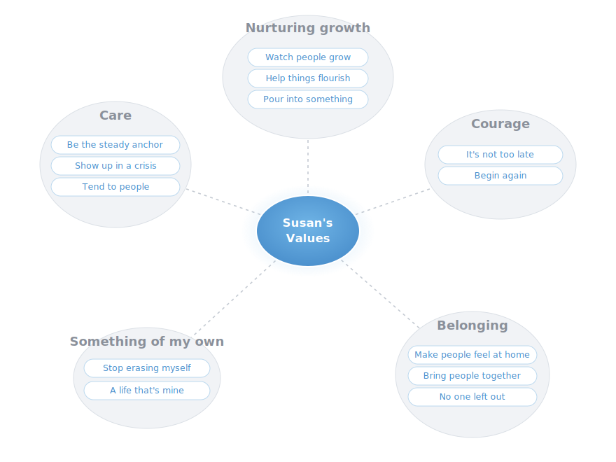
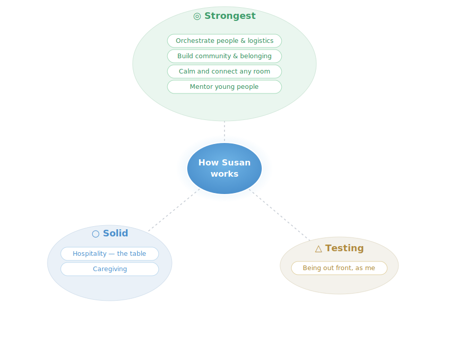
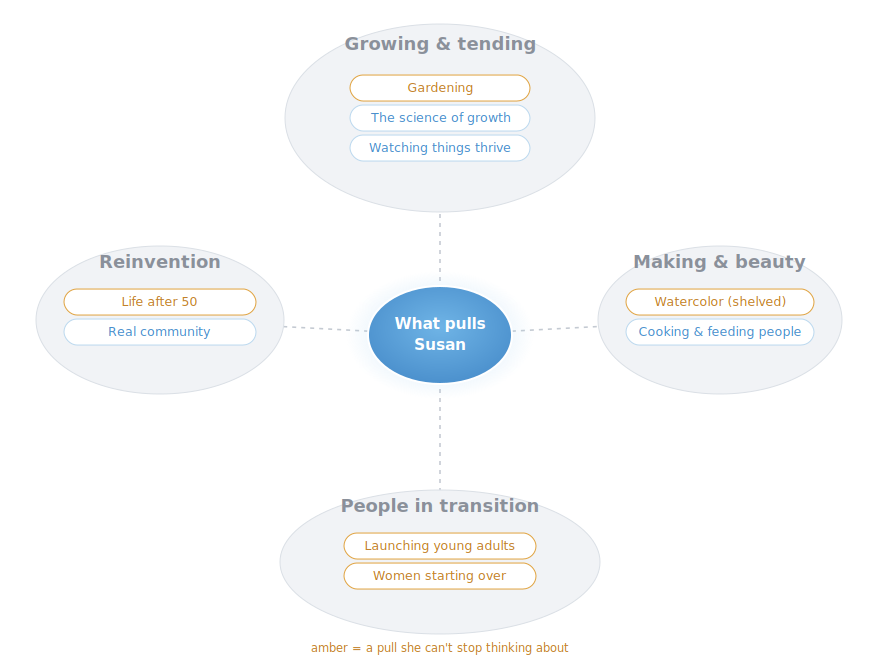
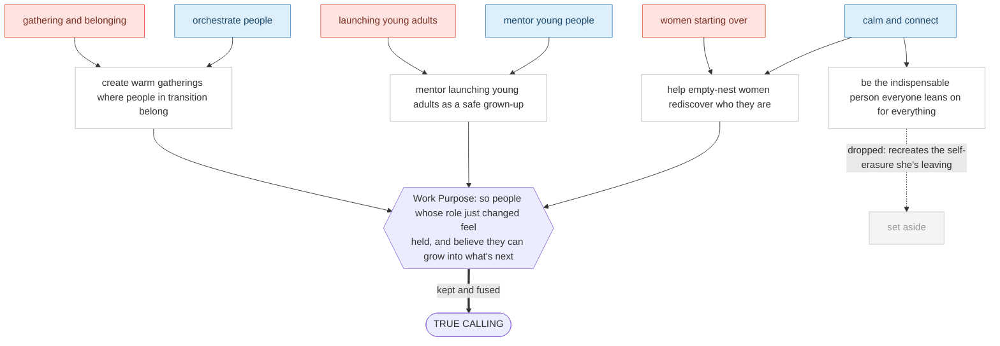

# Example — fast-track run, fully annotated: an empty-nest mom

A complete **fast** journey (15 questions) following [`../AGENTS.md`](../AGENTS.md), with **every step exposed** — each question, the user's full answer, and the **keyword extraction** (phrase → keyword → where it maps, including *anti-signals*).

Persona played for the answers: **Susan**, 53. Taught second grade for four years, then stayed home for twenty raising two kids. Her youngest left for college two months ago — the house is silent. She's the hardest case for any "find your calling" method, because **she's convinced she has no skills**: "I haven't worked in twenty years. When people ask what I do, I freeze." The job here isn't to *give* her a calling — it's to make her *see* the one she's been living.

> Format: **Q** → **Susan** (her answer) → **🔍 Extraction**. Watch especially how the extraction treats "just mom stuff" as the executive-level talent it actually is.

---

## Step 0 — setup

**Guide:** Fast (~15 min) or full (~45)? Want the 5 myths first?
**Susan:** Fast. And — fair warning — I'm not sure I'll have much to say. I haven't done anything in twenty years.
**Guide:** Let's see. I think you've done more than you're giving yourself credit for. One question at a time.

---

## Stage 1 — Values

**Q1.** Who do you respect — and what *specifically* about them?

**Susan:** My mom. She made our house the one everybody ended up at — not because it was fancy, but because everyone felt welcome, fed, and actually listened to. When she was dying, the line of people who came to thank her went out the door. And my friend Karen — at fifty she went back to school and became a nurse. She just wasn't afraid it was too late.

**🔍 Extraction**
| Phrase from the answer | Keyword | Maps to |
|---|---|---|
| "made our house the one everybody ended up at… welcome, fed, listened to" | creating a home people belong in | **Belonging** |
| "the line of people who came to thank her" | being a quiet pillar to many | **Care / Contribution** |
| "at fifty… wasn't afraid it was too late" | beginning again, late | **Courage** (anti-signal: rejects "too late") |

**Q2.** What experience in your youth shaped you most, and how?

**Susan:** My parents divorced when I was twelve and home got chaotic. I sort of became the one who held it together — made dinner, kept my little brother calm, smoothed things over between everyone. I hated that I had to. But I learned I'm the steady one when everything's falling apart.

**🔍 Extraction**
| Phrase from the answer | Keyword | Maps to |
|---|---|---|
| "the one who held it together… steady when everything's falling apart" | being the anchor in chaos | **Care** + *talent signal (emotional anchoring)* |
| "kept my brother calm, smoothed things over" | de-escalating, caretaking | **Compassion** |
| "I hated that I *had* to" | *she frames a real talent as a burden* | ⚠ undervaluing — flag for the talents stage |

**Q3.** What do you feel is missing or wrong in society today?

**Susan:** People are so isolated now. Everyone's behind a screen, nobody just drops by. And kids go off to college and their parents are suddenly alone in a quiet house with no idea what hit them. There's no soft place to land when your whole role changes overnight. I'm living it.

**🔍 Extraction**
| Phrase from the answer | Keyword | Maps to |
|---|---|---|
| "people are isolated… nobody drops by" | loss of real connection | **Belonging** |
| "no soft place to land when your role changes" | people in transition go unheld | **Care / Contribution** + *domain signal* |
| "I'm living it" | her own empty-nest grief | cross-thread |

**Q4.** What would your husband say you value most?

**Susan:** Dave would say I value taking care of people — I genuinely can't relax if someone I love isn't okay. He'd probably add, gently, that I value *being needed* a little too much, and that now the kids are gone I don't know what to do with myself.

**🔍 Extraction**
| Phrase from the answer | Keyword | Maps to |
|---|---|---|
| "can't relax if someone isn't okay" | caretaking | **Care** |
| "values being needed too much… don't know what to do with myself" | ⚠ **trap value: being needed** | probe before trusting |

> **Trap-value probe (in full):**
> **Guide:** When the kids needed you around the clock, what did giving them that actually give *you*?
> **Susan:** …purpose. The feeling my day mattered. Like I was *growing* something — them. Huh. I don't think I miss being needed, exactly. I miss having something to pour myself into and watch grow.
> **🔍 Extraction (post-probe):** "being needed" → **not the core**. It resolves into **Nurturing growth** (watching something/someone grow) + **Purpose/mattering** (**Contribution**). She doesn't need to be *depended on*; she needs to *cultivate growth*. That distinction reshapes everything downstream.

**Q5.** Advising a young person — the #1 thing you'd most want to tell them, and what you'd most *not*?

**Susan:** I'd most want to tell them: "Your life isn't a straight line, and the detours are where you actually become someone." What I'd *not* want to tell them is what I told myself for twenty years — "put yourself last, that's what a good mom does." I'm proud of how I raised them. But I erased myself doing it, and I wouldn't wish that on anyone.

**🔍 Extraction**
| Phrase from the answer | Keyword | Maps to |
|---|---|---|
| "the detours are where you become someone" | growth through change | **Nurturing growth** (now turned on herself) |
| "*not* 'put yourself last, erase yourself'" | rejects the self-sacrifice script | **Something of my own** (anti-signal: rejects self-erasure) |

### Tally → ranked top 5

| Value | Hits | Evidence |
|---|---|---|
| **Care** | 4 | Q1, Q2, Q3, Q4 |
| **Nurturing growth** | 3 | Q4 probe, Q5 ×2 |
| **Belonging** | 2 | Q1, Q3 |
| **Courage** | 1 | Q1 (but stated with real force) |
| **Something of my own** | 1 | Q5 (new, and the whole reason she's here) |

**Guide:** If you could keep only three?
**Susan:** Nurturing growth — that's the word I didn't have. Belonging. And… something of my own. Saying that last one out loud feels almost selfish.
**Guide:** It isn't. After twenty years of pouring out, wanting a life that's also yours is the healthiest thing on this list.

**Ranked:** 1) Nurturing growth · 2) Belonging · 3) Care · 4) Courage · 5) Something of my own. ("Being needed," her stated value, is gone — the probe replaced it with the truer one.)

**Work Purpose:**
> *"So people whose role just changed feel held — and believe they can still grow into what's next."*

**Susan:** That's… that's both them and me, isn't it.

---

## Stage 2 — Talents

*(This is the stage that matters most for Susan. Her talents are real and large; she just can't see them. Watch the extraction name them.)*

**Q1.** What experience felt the most fulfilling?

**Susan:** Honestly? I ran our school's spring fundraiser for six years. The last year we raised more than the district had ever seen — I coordinated eighty volunteers, the auction, the sponsors, all of it. But what I loved wasn't the money. It was that shy parents who'd never volunteered found a place, and by the end there was this whole community that hadn't existed before. I built that.

**🔍 Extraction**
| Phrase from the answer | Talent | Rating + why |
|---|---|---|
| "coordinated 80 volunteers, the auction, sponsors… record amount" | orchestrating complex operations at scale | **◎** — this is executive-level ops, not "the fundraiser" |
| "shy parents found a place… a community that hadn't existed" | building community / making people belong | **◎** — and it's what she loved, not the money |

> **Guide (reframing, out loud):** Susan — you just described running an eighty-person operation with a record P&L and a community-building outcome. On a résumé that's "Director of Volunteer Operations." You called it "the fundraiser."

**Q2.** What's recently made you irritated or anxious?

**Susan:** The silence. And when people ask "so what do you *do*?" and I freeze, because "I raised my kids" doesn't sound like an answer to them. It makes me feel like the last twenty years just… don't count.

**🔍 Extraction**
| Phrase from the answer | Talent | Rating + why |
|---|---|---|
| "'I raised my kids' doesn't count… twenty years don't count" | *her talents are invisible to her* | not a talent — it's THE obstacle the maps exist to fix |

**Q3.** What does your husband say your strengths are?

**Susan:** Dave says I can walk into any tense room — his family at the holidays, a PTA blowup — and twenty minutes later everyone's calm and talking again. And that our house was the one all the kids' friends wanted to be at. He says they came for me, not the snacks.

**🔍 Extraction**
| Phrase from the answer | Talent | Rating + why |
|---|---|---|
| "walk into a tense room… everyone calm and talking again" | de-escalating / emotional anchoring | **◎** — proven across many rooms |
| "all the kids' friends wanted to be at our house… came for me" | making a space people feel safe and seen in | **◎** |

**Q4.** Your old role just vanished — what do you miss most?

**Susan:** The kids' friends who'd sit at my kitchen island and tell me things they couldn't tell their own parents. I'd make them tea and just listen, and somehow they'd leave lighter. I miss being a safe grown-up for a young person figuring life out.

**🔍 Extraction**
| Phrase from the answer | Talent | Rating + why |
|---|---|---|
| "told me things they couldn't tell their parents… left lighter" | being a trusted mentor for young people | **◎** — a real, named gift (and a direct clue to her calling) |
| "make them tea and just listen" | hospitality + deep listening, fused | her signature medium |

**Q5.** What results have you achieved, and *exactly how*?

**Susan:** I raised two kids who are kind and not lost — that's what I'm proudest of. How? I paid attention to who each of them actually was, not who I wanted them to be, and I built a home where they could fail safely and try again. …Which, now that I say it out loud, is exactly what I did with the fundraiser. Pay attention to each person, make it safe, and things grow.

**🔍 Extraction**
| Phrase from the answer | Talent | Rating + why |
|---|---|---|
| "paid attention to who each one was… a home where they could fail safely" | her method: *see each person + make it safe → growth* | **◎** — she just named her own mechanism |
| "exactly what I did with the fundraiser" | the talent is *transferable*, not "mom stuff" | the realization that unlocks everything |

**Pattern revealed:** twenty years of "just being a mom" was a sustained masterclass in **operations, emotional leadership, community-building, and mentoring** — the same mechanism every time: *see each person → make it safe → things grow.* Nothing here is a gap on a résumé. It's the résumé.

---

## Stage 3 — Love

**Q1.** What would you happily pay to study right now?

**Susan:** Gardening — really study it, the science of it, not just keeping things alive. And I've quietly always wanted to learn watercolor properly. I gave it up when the kids came and never went back.

**🔍 Extraction**
| Phrase | Domain | Intensity |
|---|---|---|
| "gardening… the science of it" | growing & tending | 🔥 |
| "watercolor… gave it up when the kids came" | a shelved creative love | 🔥 (note: *grief* attached — a love she abandoned) |

**Q2.** What's on your bookshelf?

**Susan:** Cookbooks, lots. Books about gardens. Family novels. And — a little embarrassing — a whole stack of "what's your second act / reinventing yourself after fifty" books that I bought and haven't opened.

**🔍 Extraction**
| Phrase | Domain | Intensity |
|---|---|---|
| "second act / reinventing after fifty" | reinvention, life after 50 | 🔥 (she's literally researching her own ikigai) |
| "cookbooks… gardens" | feeding people; growing things | warm |

**Q3.** Anything that ever made you feel "this saved me"?

**Susan:** A women's group at my church when I was a brand-new mom, drowning. Older women who'd been through it just… caught me. I always thought I'd want to be that for the next batch of overwhelmed women someday. And the garden — when my mom was dying, it was the only place I could breathe.

**🔍 Extraction**
| Phrase | Domain | Intensity |
|---|---|---|
| "older women caught me… I'd want to be that" | women supporting women in transition | 🔥 |
| "the garden… the only place I could breathe" | growing things as solace | 🔥 |

**Q4.** Whose work do you want to thank?

**Susan:** My mom. Those church women. And honestly — the kids' friends who still text me from college. They remind me I mattered to them, not just to my own kids.

**🔍 Extraction**
| Phrase | Domain | Intensity |
|---|---|---|
| "kids' friends still text me… I mattered to them" | mentoring young adults | warm (reinforces the ◎ talent) |

**Q5.** What social issue makes you angry?

**Susan:** How invisible women my age become — like our whole experience evaporates the moment the kids leave. And how lonely young adults are now; my son's friends are so anxious and adrift. Two whole groups nobody's really tending to: women starting over, and kids launching into a world that scares them.

**🔍 Extraction**
| Phrase | Domain | Intensity |
|---|---|---|
| "invisible women my age… experience evaporates" | women starting over | 🔥 |
| "lonely young adults… anxious and adrift" | launching young adults | 🔥 |

*(Like the [teacher's run](walkthrough-fast-language-teacher.md), two audiences surface from the anger question — here, the two groups she's spent her life tending.)*

---

## Stage 4 — Synthesis

**Step 1 — candidates (Love × Talent), no job titles:**
1. Creating warm gatherings where isolated people (especially midlife women) feel they belong
2. Mentoring launching young adults as the safe grown-up they can be honest with
3. Helping empty-nest women rediscover who they are and that it's not too late
4. Bringing people together around a table to be held during a hard stretch
5. Being the indispensable person everyone leans on for everything

**Step 2 — filter through her Work Purpose** ("so people whose role just changed feel held and believe they can grow into what's next"):

The dropped candidate is the sharp one: *"be the indispensable person everyone leans on"* is her old **trap value** (being needed) wearing a new coat — it would re-erase her. The filter rejects it precisely because her Work Purpose is about *others growing*, and her #5 value is *not erasing herself again*. The audit catches the relapse on screen.

> ### Susan's true calling (a hypothesis, not a verdict)
> **"Creating the warm, steady spaces — a table, a circle, a mentoring relationship — where people whose role just changed (launching young adults, women starting over) feel held and believe they can grow into what's next."**

**Guide:** Off anywhere — values, talent, or love?
**Susan:** No. And the thing I kept apologizing for — twenty years "just" at home — that's not a gap before this. It's the *training* for it. I'm not starting over at zero. I'm starting from twenty years of doing exactly this.

*(Same shape as the others — the engineer's "fear → material," the teacher's "loss → qualification." Here: "the gap → the training." It's usually the moment the calling stops feeling like a stretch.)*

---

## Stage 5 — Means (now job titles are welcome)

| Means | Day-to-day | Why it fits | First step (this week) | Timeframe |
|---|---|---|---|---|
| **Mentor / coach for launching young adults** | The kitchen-island role, on purpose | her ◎ mentoring + "safe grown-up" gift | Offer to mentor 2 of her son's friends who are struggling; or contact a youth-mentoring org | short |
| **Facilitate an empty-nest / "second act" women's circle** | Convene women in her exact transition | she *is* one; warmth + holding + belonging | Invite 4 empty-nest friends over this week; ask how they're *really* doing | **this week** |
| **Volunteer-program / events coordinator (nonprofit)** | Run operations & community for a cause | her record fundraiser = a real, hireable skill | Email one local nonprofit about a coordinator role | medium |
| **Host a recurring "everyone's welcome" supper club** | Bring isolated neighbors to one table | hospitality as her medium | Host one dinner for neighbors who don't know each other | short |

**Daily practices:** reach out to one person in a transition; spend 15 min in the garden and note one thing that's growing. **Weekly ritual:** convene one gathering — *and* take one watercolor session that is purely *hers* (reclaiming "something of my own," not a career).

**First step she commits to:** invite four empty-nest friends over this week, and ask them how they're *really* doing. (Her calling, in miniature — a warm space where people in transition feel held.)

---

## Builder's verdict — the hardest case

Susan is the stress test: someone who arrives saying *"I haven't done anything in twenty years."* The method's job was to make the invisible visible, and it did:

- **It named talents she'd dismissed.** "The fundraiser" → orchestrating an 80-person operation. "Holding the family together at twelve" → emotional anchoring. "Kids' friends at the kitchen island" → mentoring young adults. None of these felt like talents to her; the per-answer extraction lifted each one out and the talents map made them undeniable.
- **The reframe was structural, not a pep talk.** "The gap is the training" came from her own Q5 ("same thing I did with the fundraiser"), not from the guide cheerleading. The method surfaced it; it landed because it was *hers*.
- **The trap-value probe did double duty again.** "Being needed" got demoted to "nurturing growth" in values — then the synthesis caught it trying to return as "be the indispensable person everyone leans on" and dropped it, *citing her own value of not re-erasing herself.* That's the audit catching the exact bias that would have sent her back into 20 more years of self-erasure.
- **It protected the tender new value.** "Something of my own" was fragile (she called it "selfish"); the means honored it (the watercolor practice "purely hers") instead of letting the calling become one more act of pouring out.

Caveat as always: I played both sides, so Susan is more articulate and less raw than a real woman two months into a silent house. A live run would need far more patience, more "I don't know," more sitting with grief before the talents surface. But the mechanism — phrase → keyword → mapped, anti-signals, the tally, the trap caught twice — is exactly what a faithful agent does, and it's what turns "I haven't done anything" into "I've been training for this for twenty years."
