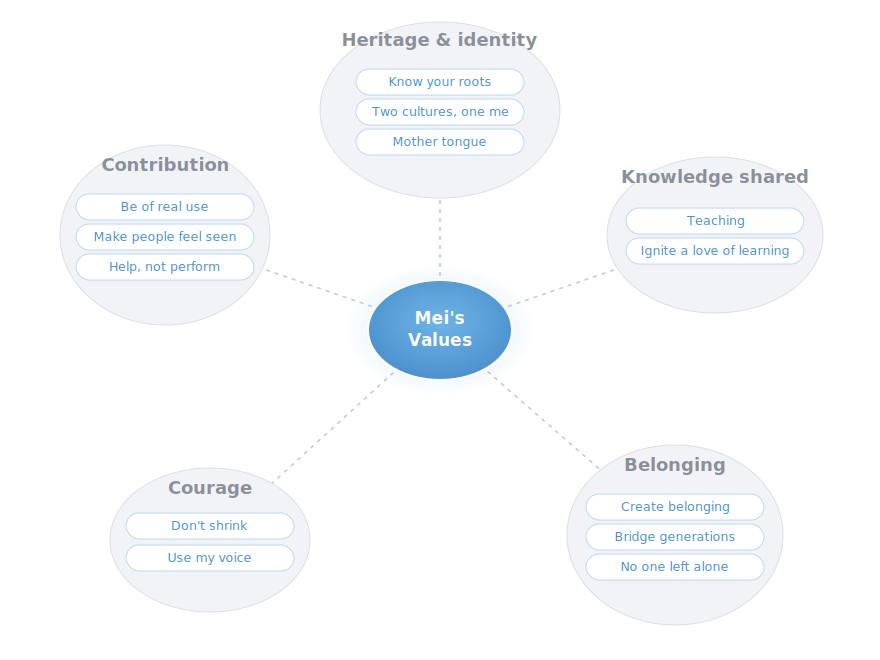
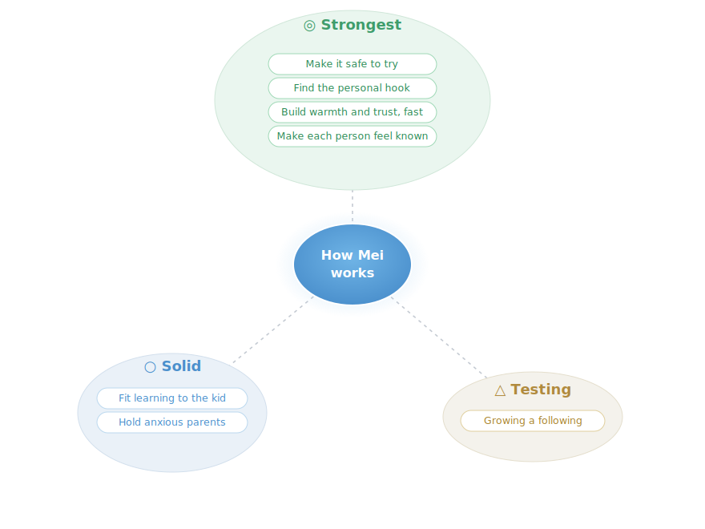
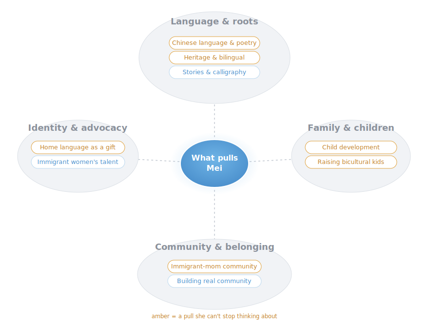
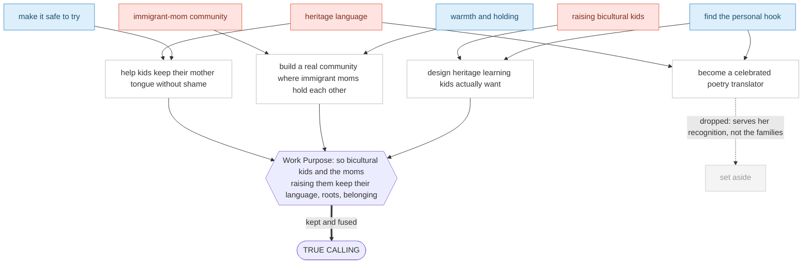

# Example — fast-track run, fully annotated: a language teacher at a crossroads

A complete **fast** journey (15 questions) following [`../AGENTS.md`](../AGENTS.md), with **every step exposed** — each question, the user's full answer, and the **keyword extraction** (phrase → keyword → where it maps, including *anti-signals*).

Persona played for the answers: **Mei Lin**, 32. Taught Chinese literature to middle-schoolers in Xi'an for six years — loved it. Came to Seattle ~3.5 years ago when her husband took a tech job; on a dependent visa she could only do part-time weekend Mandarin teaching. Had a daughter six months ago. Got her green card last month. She's at a triple threshold: *settling* in a new country, *becoming* a mother, and suddenly *permanent* — "I'm staying. So what do I actually build here?" Underneath: her professional self shrank when she immigrated ("I went from a respected teacher to 'the tutor'").

> Format: **Q** → **Mei** (her answer) → **🔍 Extraction**.

---

## Step 0 — setup

**Guide:** Fast (~15 min) or full (~45)? Want the 5 myths first?
**Mei:** Fast — the baby naps for forty minutes if I'm lucky. No myths.

---

## Stage 1 — Values

**Q1.** Who do you respect — and what *specifically* about them?

**Mei:** My grandmother. She raised five children through hard years, and still, every evening, taught the neighborhood kids to read — for free. People called her "teacher" her whole life, though she never had a title. I respect that she gave knowledge away and it made her the heart of a whole community. Also my mentor teacher in Xi'an, who made fourteen-year-olds fall in love with poetry they were sure was boring.

**🔍 Extraction**
| Phrase from the answer | Keyword | Maps to |
|---|---|---|
| "gave knowledge away… heart of the community" | generosity of knowledge, community | **Knowledge shared** + **Belonging** |
| "called her 'teacher'… never had a title" | teacher-identity without status | **Knowledge shared** (anti-signal: *not* title/status) |
| "made teenagers fall in love with poetry" | igniting a love of learning | **Knowledge shared** |

**Q2.** What experience in your youth shaped you most, and how?

**Mei:** When I was ten we moved cities and I was the outsider — wrong accent, knew no one. A teacher noticed and quietly paired me with a classmate to help me belong. Within a month I wasn't alone anymore. It taught me that belonging isn't automatic — someone has to *make* it — and that one adult paying attention can change whether a child feels they exist.

**🔍 Extraction**
| Phrase from the answer | Keyword | Maps to |
|---|---|---|
| "belonging isn't automatic — someone has to make it" | belonging must be created | **Belonging** |
| "one adult paying attention can change a child" | individual care/attention | **Contribution** + **Compassion** |
| "I was the outsider… wrong accent" | *(cross-thread: mirrors her own immigration now)* | → carries into Love/synthesis |

**Q3.** What do you feel is missing or wrong in society today?

**Mei:** Here, so many immigrant kids are quietly losing their mother tongue — and with it, the ability to really talk to their own grandparents. Their parents are too exhausted to fight it. And immigrant mothers like me sort of *disappear* — we had whole careers and identities back home that don't count here, and nobody sees that loss.

**🔍 Extraction**
| Phrase from the answer | Keyword | Maps to |
|---|---|---|
| "kids losing their mother tongue… can't talk to grandparents" | heritage language as a generational bridge | **Belonging** + *domain signal* |
| "immigrant mothers disappear… don't count here" | unseen loss of immigrant women | **Contribution** (make them seen) |
| "nobody sees that loss" | being unseen | **Contribution** |

**Q4.** What would your husband say you value most?

**Mei:** He'd say I value *being needed* — that I light up when someone genuinely needs what I can give. He'd probably also say, gently, that I worry too much about being seen as *successful*, especially since the move cost me my standing.

**🔍 Extraction**
| Phrase from the answer | Keyword | Maps to |
|---|---|---|
| "light up when someone needs what I can give" | being of real use | **Contribution** (probe: need vs. giving) |
| "worry about being seen as successful… lost my standing" | ⚠ status / recognition | **trap value** → probe |

> **Trap-value probe (in full):**
> **Guide:** If you imagine already having all the recognition you could want — what would that free you to actually *do*?
> **Mei:** Honestly… I'd stop performing, and just teach the way I know is right. And be fully present with my daughter without feeling like I'm "wasting" my education. The recognition was never the point — it was proof I still mattered after we moved.
> **🔍 Extraction (post-probe):** "being successful" → **not a core value**. It resolves into **Contribution** (mattering by helping) + **Identity/self-worth** + permission to be **present (Family)**. Surface word dropped. (And "being needed" → on probing, it's the *giving* she values, not being depended on — so it stays **Contribution**, not dependency.)

**Q5.** Advising your daughter — the #1 thing you'd most want to tell her, and what you'd most *not*?

**Mei:** I'd most want to tell her: "Know where you come from, and you'll never be lost anywhere." What I'd *not* want to tell her is what I absorbed growing up — "keep your head down, don't make trouble, be the good quiet girl." I did exactly that, and it made me small. I won't hand her my smallness.

**🔍 Extraction**
| Phrase from the answer | Keyword | Maps to |
|---|---|---|
| "know where you come from, you'll never be lost" | roots as the ground of identity | **Heritage & identity** |
| "*not* 'keep your head down, be the quiet girl'" | rejects self-erasure | **Courage** (anti-signal: *not* invisibility/compliance) |
| "it made me small… won't hand her my smallness" | refusing to shrink | **Courage** |

### Tally → ranked top 5

| Value | Hits | Evidence |
|---|---|---|
| **Contribution** | 4 | Q1-implied, Q2, Q3 ×2, Q4 |
| **Belonging** | 3 | Q1, Q2, Q3 |
| **Knowledge shared** | 3 | Q1 ×3 |
| **Heritage & identity** | 2 | Q3, Q5 |
| **Courage** | 2 | Q5 ×2 |

**Guide:** If you could keep only three?
**Mei:** Contribution, Belonging, and… honestly, Heritage. Teaching is *how* I do those. And Courage is the thing I'm still learning.

**Ranked:** 1) Contribution · 2) Belonging · 3) Heritage & identity · 4) Knowledge shared · 5) Courage. ("Being successful," her stated value, is deliberately absent — the probe demoted it.)

**Work Purpose:**
> *"So bicultural kids — and the mothers raising them — keep their language and their roots, and feel they belong in both worlds."*

**Mei:** Oh. Yes. I've felt that for two years and never said it out loud.

---

## Stage 2 — Talents

*(the "keyword" is the talent under the story, plus the ◎/○/△ rating and its reason)*

**Q1.** What experience felt the most fulfilling?

**Mei:** A shy boy in my Saturday class refused to speak Mandarin — embarrassed of his accent next to the fluent kids. So I started making tiny comic strips with him, in Chinese, about his favorite video games. Three months later he stood up and told a whole story to the class. His mom cried. I didn't exactly *teach* him Chinese — I made it *safe* for him to use it.

**🔍 Extraction**
| Phrase from the answer | Talent | Rating + why |
|---|---|---|
| "made it safe for him to use it" | creating safety to try / drawing out | **◎** — he spoke, his mom cried (real result) |
| "comic strips about his video games" | meeting a learner where they are | **◎** — finding the personal hook |

**Q2.** What's recently made you irritated or anxious?

**Mei:** Generic worksheet curriculums that treat every kid the same and bore them right out of the language. And — being honest — the fear that after the baby and the move, I've lost my edge. That I'm "just a mom" now.

**🔍 Extraction**
| Phrase from the answer | Talent | Rating + why |
|---|---|---|
| "worksheets that treat every kid the same" | bothered by impersonal teaching | **○** — points to her gift for personalizing |
| "'just a mom now'… lost my edge" | *(identity anxiety — cross-thread, not a talent)* | → the wound the calling will heal |

**Q3.** What does your husband say your strengths are?

**Mei:** He says I can make anyone comfortable in about five minutes — strangers tell me their life stories. And that I'm relentless about finding the one thing that'll make a concept click for a *specific* kid.

**🔍 Extraction**
| Phrase from the answer | Talent | Rating + why |
|---|---|---|
| "make anyone comfortable… strangers tell me their stories" | building warmth & trust, fast | **◎** — others rely on it |
| "finding the one thing that makes it click for a specific kid" | finding the personal hook | **◎** — her teaching superpower |

**Q4.** If you stopped teaching tomorrow, what would you miss?

**Mei:** The moment a kid's eyes change when they suddenly *get* it. And the parents — somehow I've become the person immigrant moms text at 11pm: "is my kid going to be okay? am I doing this right?" I'd miss being that for them.

**🔍 Extraction**
| Phrase from the answer | Talent | Rating + why |
|---|---|---|
| "the moment a kid's eyes change" | igniting the click | **◎** — what she'd grieve losing |
| "moms text me at 11pm… am I doing this right" | holding anxious mothers | **○** — *a second audience appears: the mothers, not just the kids* |

**Q5.** What results have you achieved, and *exactly how*?

**Mei:** My weekend class grew from 4 kids to 30 in two years — pure word of mouth, no advertising. How? I made each family feel their child was genuinely *known*. Parents referred friends because, for once, their kid actually *wanted* to go to Chinese school.

**🔍 Extraction**
| Phrase from the answer | Talent | Rating + why |
|---|---|---|
| "4 to 30, no ads… each child genuinely known" | making each person feel known | **◎** — proven, and it scaled |
| "their kid actually wanted to go" | makes heritage learning *desirable* | her distinctive result |

**Pattern revealed:** her ◎ talents all serve *two* audiences at once — the **child** (safe to try, the personal hook) and the **mother** (warmth, holding). Hold that; it shapes the calling.

---

## Stage 3 — Love

*(the "keyword" is the field/domain, plus intensity — 🔥/amber = can't-not-think-about-it)*

**Q1.** What would you happily pay to study right now?

**Mei:** How children actually acquire a second language and *stay* bilingual — the research on heritage-language loss. And, now that I'm a mother, child development.

**🔍 Extraction**
| Phrase | Domain | Intensity |
|---|---|---|
| "how children stay bilingual… heritage-language loss" | heritage & bilingual learning | 🔥 |
| "child development" | child development | 🔥 |

**Q2.** What's on your bookshelf?

**Mei:** Tang poetry. My old Chinese-literature textbooks — I couldn't leave them behind. Picture books in both languages for the baby. And lately, books on immigrant identity and raising third-culture kids.

**🔍 Extraction**
| Phrase | Domain | Intensity |
|---|---|---|
| "Tang poetry… Chinese-literature textbooks" | Chinese language & poetry | 🔥 |
| "raising third-culture kids" | raising bicultural kids | 🔥 |

**Q3.** Anything that ever made you feel "this saved me"?

**Mei:** When I was a drowning new immigrant mom, a group of other Chinese moms in my city — we shared everything, from which pediatrician to how to keep our kids speaking Chinese. That little community kept me sane. I keep thinking: I want to build something like that, but *real* — not just a group chat.

**🔍 Extraction**
| Phrase | Domain | Intensity |
|---|---|---|
| "a group of moms… kept me sane" | immigrant-mom community | 🔥 |
| "build something real, not just a chat" | building real community | 🔥 |

**Q4.** Whose work do you want to thank?

**Mei:** My grandmother. My mentor teacher. And the volunteer who ran that moms' group — she had a newborn too and still held us all together.

**🔍 Extraction**
| Phrase | Domain | Intensity |
|---|---|---|
| "held us all together… with a newborn" | community-holding as devotion | warm (ties to her ◎ "holding" talent) |

**Q5.** What social issue makes you angry?

**Mei:** That schools treat a kid's home language as a *problem to fix* instead of a gift to keep. And that we lose a whole generation of mothers' talents, because the system has no slot for a "foreign" teacher's credentials.

**🔍 Extraction**
| Phrase | Domain | Intensity |
|---|---|---|
| "home language as a problem, not a gift" | home language as a gift | 🔥 (anger = heat) |
| "lose a generation of mothers' talents" | immigrant women's wasted talent | 🔥 |

---

## Stage 4 — Synthesis

**Step 1 — candidates (Love × Talent), no job titles:**
1. Helping bicultural kids keep their mother tongue without shame
2. Building a *real* community where immigrant moms hold each other up
3. Designing heritage-language learning kids actually *want* to do
4. Teaching immigrant parents how to keep their kids bilingual at home
5. Helping immigrant mothers see that their own gifts still count here
6. Translating Chinese poetry so bicultural kids feel proud of their roots

**Step 2 — filter through her Work Purpose** ("so bicultural kids and the mothers raising them keep their language, roots, and belonging"):

Note the dropped candidate — "become a celebrated poetry translator" — is exactly her old **trap value** (recognition) trying to sneak back in through the side door. The filter catches it, visibly.

> ### Mei's true calling (a hypothesis, not a verdict)
> **"Making it safe and joyful for bicultural children to keep their mother tongue — and helping the immigrant mothers raising them feel that they, and their gifts, still belong here."**

**Guide:** Starting point, not a verdict. Off anywhere — values, talent, or love?
**Mei:** No. And — the move and the baby, the things that made me feel like I *lost* my career… they're exactly what makes me the right person for this. I'm not behind. I'm qualified.

*(That reframe — "the loss is the qualification" — is the same shape as the engineer's "the fear is the material." It tends to be the moment the calling becomes undeniable.)*

---

## Stage 5 — Means (now job titles are welcome)

| Means | Day-to-day | Why it fits | First step (this week) | Timeframe |
|---|---|---|---|---|
| **Found a heritage-language micro-school / weekend program** | Run her own bilingual program (she already has 30 families) | her whole ◎ cluster + every value | Invite the 30 families to a "founding parents" tea to build it together | medium |
| **Bilingual-parenting workshops for immigrant parents** | Teach parents to keep kids bilingual at home | personal hook + child development + reaching the mothers | Host one free online workshop: "Keeping your child's Chinese alive" | **this week** |
| **An immigrant-mothers' community (real, not a chat)** | In-person meetups + mutual support | warmth/holding + her "this saved me" domain | Host one in-person playdate-meetup this month | short |
| **Bilingual learning materials (her comic-strip method)** | A small published series | make-it-safe + personal hook, productized | Make one comic-strip lesson and share it with her families | medium |

**Daily practices:** read one Chinese story with her daughter and note what made her light up; message one immigrant mom with one concrete tip.
**Weekly ritual:** host or join one gathering; write one short reflection for other bilingual parents.

**First step she commits to:** host a free "Keeping your child's Chinese alive" workshop for her mom group this month — *and ask them what they most need*, so the school she builds is theirs, not just hers.

---

## Builder's verdict — does it generalize?

This is a deliberately different life from the [engineer's run](walkthrough-fast-ai-engineer.md) — humanities not tech, a woman, an immigrant mother at a permanence threshold — and the method held:

- **Same machinery, totally different output.** Phrase → keyword → value → calling worked identically; the *content* is unrecognizably hers. Nothing about the method assumes a career type.
- **The trap-value probe did real work again.** "Being successful" (an immigration ego-wound) entered as a stated value and was demoted — and then the synthesis *caught it trying to return* as "celebrated poetry translator" and dropped it on screen. That's the audit catching the same bias twice.
- **A second audience surfaced from one phrase.** "Moms text me at 11pm" (a single talent answer) revealed that she serves the *mothers*, not only the kids — and that became half the calling. A summary-only method would have missed it.
- **The life-stage became the qualification, not the obstacle.** New baby + new green card + lost career read as setbacks going in; the calling reframed them as exactly why she's the right person. The method surfaced that; I didn't impose it.

Caveat, same as always: I played both sides, so Mei is more articulate and consistent than a real person mid-newborn-fog. A live run is slower and messier — but the per-step mechanism shown here is what a faithful agent does.
