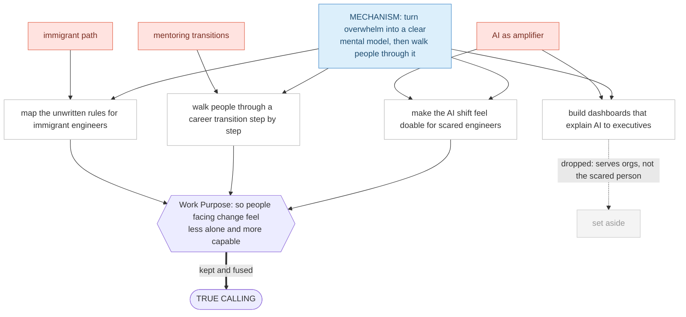

# Example — FULL-track run: the same engineer, gone deep

Same persona as the [fast run](walkthrough-fast-ai-engineer.md) — **Wei Chen**, 36, 10-year engineer rattled by the AI shift — but on the **full** track: 30 questions per pillar plus the **8-angle deep dive** on his strongest talent. This file is **compressed on the Q&A** (the questions are in [`../questionnaires/full.md`](../questionnaires/full.md); a representative handful is shown) and **full on the reveal** — the three pillar maps and the deeper synthesis are the point.

> What the full track adds over fast: a *much* sharper talent layer (the 8-angle dive turns "good at explaining" into a precise, reusable mechanism), which in turn makes the True Calling specific instead of merely true.

---

## Stage 1 — Values (30 questions → a values map)

Sampled from the 30: *what moves you to tears* (a student thanking a teacher who believed in them) · *what you'd regret at 80* (having played it safe) · *who you respect least and why* (people who hoard knowledge to stay important) · *what you'd eliminate from the world* (talented people stuck because no one showed them the way). The deeper set converges on the **same five** the fast run found — and the trap-value probe on "security" resolves the same way (→ provide for family + do work that matters) — but with more evidence behind each.

**Reveal (per answer):** *"'people who hoard knowledge to stay important' as your least-respected → confirms **Knowledge shared** as a value, and hints it's almost a moral line for you, not just a preference."*

**Work Purpose:** *So people facing a frightening change feel less alone — and more capable of their next step.*

---

## Stage 2 — Talents (30 questions, then the 8-angle deep dive)

The 30 surface the same talents as fast, rated:

### The 8-angle deep dive — the full track's real payoff

We take his **strongest ◎** ("make the complex approachable") and one specific time it shone — *rewriting the deploy system everyone feared, after which three juniors finally understood it* — and walk all 8 angles:

| Angle | Wei's answer |
|---|---|
| 1. What led up to it | He'd been confused by it himself for weeks, then found the one mental model that made it click. |
| 2. The environment | Small team, high trust, permission to rebuild, a real deadline. |
| 3. The specific actions | He didn't just fix it — he wrote a one-page "how it *really* works" and walked each junior through it. |
| 4. The thinking behind them | *"If I can't explain it simply, I don't understand it yet."* He hunted for the simplest model on purpose. |
| 5. What he noticed | The instant a junior's face went from anxious to "oh!" — that lit him up more than shipping did. |
| 6. His motivation | Not recognition. The *relief of removing someone's confusion.* |
| 7. When it faded / how to keep it | It faded in pure-coding sprints with no one to teach. Keep it by always having someone to bring along. |
| 8. What he'd do better | Teach *earlier*, instead of solving alone first and explaining after. |

**Reusable mechanism (the distilled output):**
> *"I take something that overwhelms people, find the one mental model that makes it click, and walk them through it until their anxiety turns into 'I can do this.'"*

That's the upgrade. "Good at explaining" is generic; **overwhelm → mental model → walk-through → anxiety-into-capability** is *his*, and it's what makes the synthesis below specific.

---

## Stage 3 — Love (30 questions → a domains map)

The longer set adds an **Immigrant path** cluster the fast run only hinted at (the unwritten rules, navigating a new culture), alongside the same hot pulls.

---

## Stage 4 — Synthesis (richer, because the mechanism is sharper)

The candidate set is wider now, and the Work Purpose filter is doing more work. The logic, in the open:

> ### Wei's true calling (full-track version)
> **"Taking what overwhelms people in a frightening change, finding the one mental model that makes it click, and walking them through until their fear turns into 'I can do this' — for engineers and immigrants navigating the AI shift."**

Notice it's the *same direction* as the fast run, but **sharper**: "clear next steps" became "find the one mental model that makes it click and walk them through" — straight out of the 8-angle dive. That precision is the whole reason to spend 45 minutes instead of 15.

---

## Stage 5 — Means (one calling, many doors)

Same shape as the [fast run's means](walkthrough-fast-ai-engineer.md#stage-5--means-now-job-titles-are-welcome) — AI-enablement lead, a newsletter, coaching-track manager, a reskilling course — but each can now be described against the sharper mechanism (e.g. the course isn't "teach AI," it's "build the mental model that makes the AI shift click, then walk people through"). First step he commits to: **draft lesson 1 of "The mental model for the AI shift" and test it on 5 ex-colleagues this week.**

---

## What the full track added (verdict)

- **The 8-angle dive is the difference-maker.** It converted a generic strength into a precise mechanism, and *that* precision flowed all the way to the calling and even the framing of the means. Fast gives you a true direction; full gives you a sharp one.
- **A new domain surfaced.** 30 love-questions pulled up the "immigrant path" cluster that 5 questions missed — and it became a real candidate (mapping the unwritten rules).
- **Same trustworthy spine.** Values and Work Purpose landed in the same place as fast, with more evidence — a good sign the method is stable, not random.
- **Cost.** It's genuinely ~45 minutes and asks for real reflection. Worth it once, for a real decision; fast is the right tool for a first pass or a re-run.
