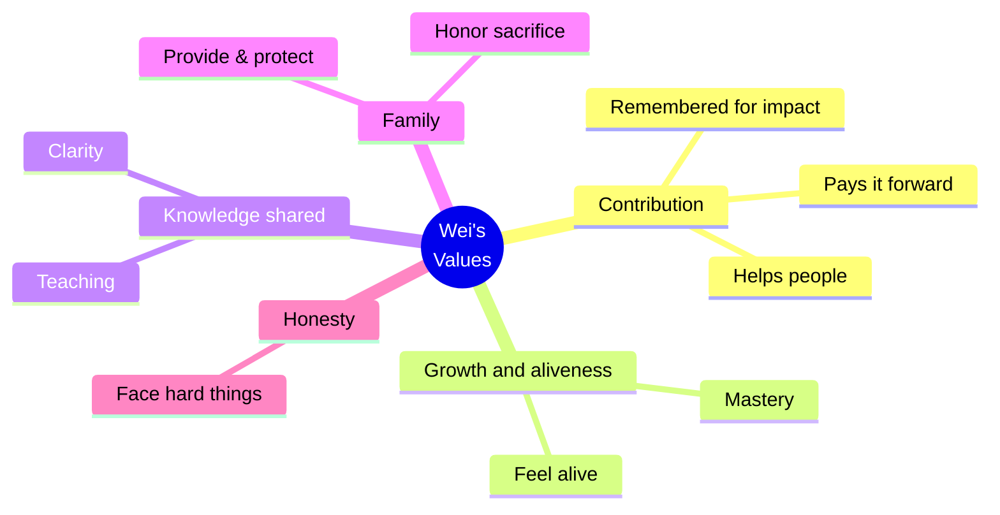
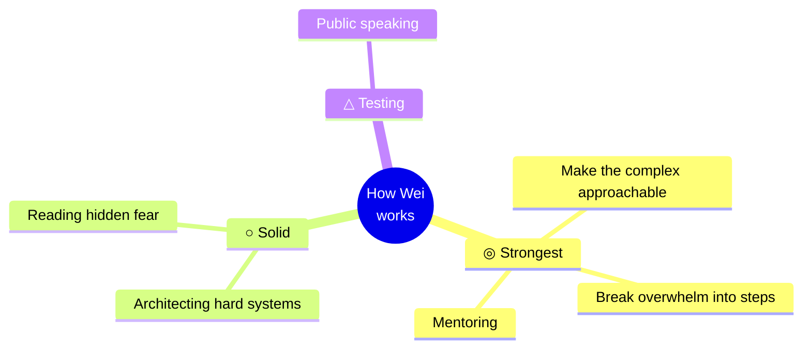
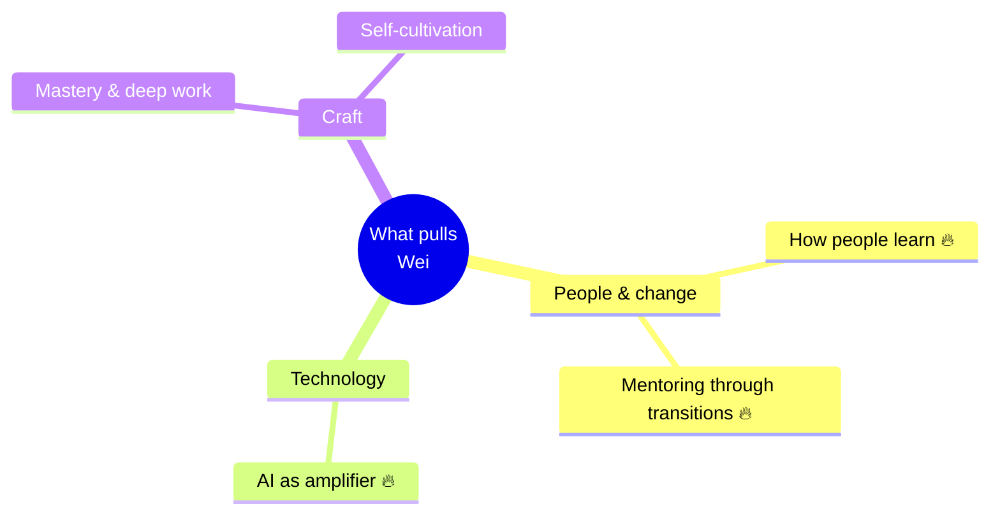
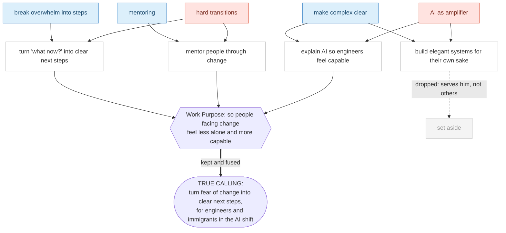
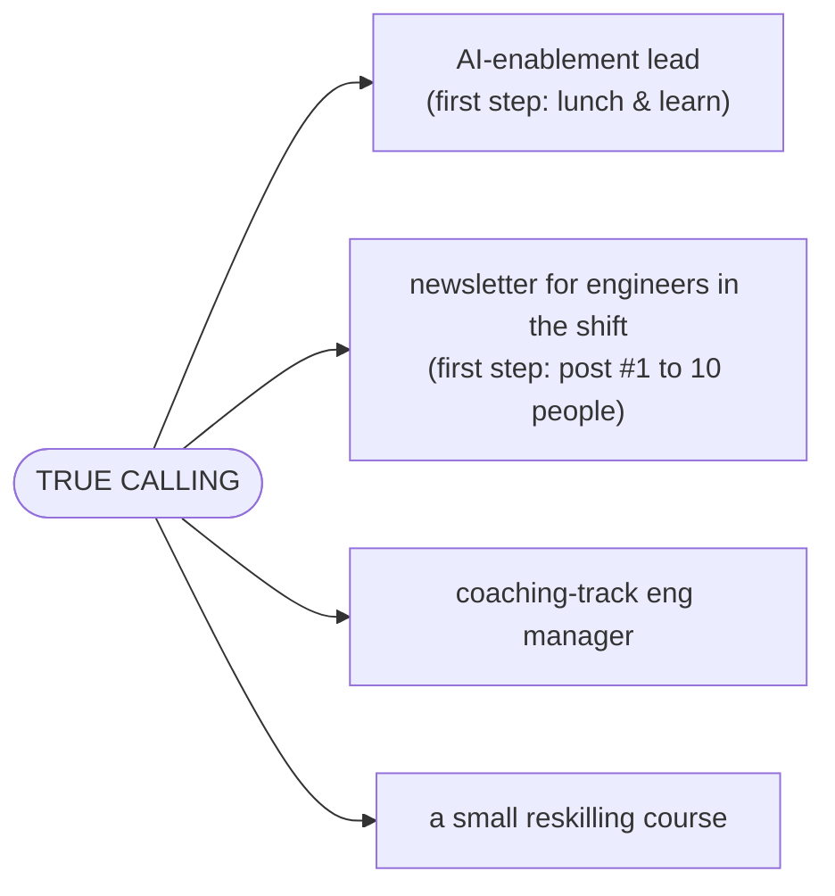

# Reveal & visualize — show your work at every step

The point of this whole journey is **not** to hand the user a verdict. It's to let them *watch their own answers become a calling* — and to be able to audit every move. So at each stage you do two things, out loud:

1. **Reveal the reasoning.** Show how a raw answer became a keyword, how keywords clustered into a value, how love × talent generated a candidate, and **which candidates the Work Purpose filter kept or dropped, and why.** Never jump to the conclusion. If the user can't see how you got there, you did it wrong — even if the answer is good.
2. **Render it.** End each stage with a diagram of what you just built. A picture makes the structure self-checkable at a glance and is the moment of self-recognition ("…yeah, that's me").

Two diagram formats — ship whichever fits the surface, or both:

- **Mermaid** (default) — you emit ~10–20 lines of text; it renders as a live diagram in GitHub, Claude/ChatGPT, Notion, Obsidian, VS Code, and most markdown surfaces. Dynamic, zero layout work. In a bare terminal it stays a readable outline. **Use this every time.**
- **SVG keepsake** ([`../assets/templates/mindmap.svg`](../assets/templates/mindmap.svg)) — the Jinpei-Yagi-style bubble map. Fill the placeholder slots with the user's words. Renders anywhere as an image; nice as the end-of-journey keepsake. Example output: [`../assets/examples/values-mindmap-example.svg`](../assets/examples/values-mindmap-example.svg).

> Always build maps from the user's **own words**, never invented ones. The map is a mirror, not a poster.

---

## Stage 1 — Values → a values mind map

First reveal the extraction in text, per answer: *"From your answer about your father and the engineer who mentored you, I'm hearing **Contribution**."* Then, after ranking, render the map — center = the person, branches = their value-themes, leaves = the specific words behind each.

````

````

For the keepsake look, fill [`../assets/templates/mindmap.svg`](../assets/templates/mindmap.svg) with the same content.

---

## Stage 2 — Talents → a tiered talents map

Reveal each talent's source and its rating rationale: *"'I rewrote the deploy system and three juniors finally understood it' → talent: **making the complex approachable**; you rated it ◎ because it energized you AND produced a real result."* Then map it, carrying the ◎/○/△ tiers as prefixes so the strongest read first.

````

````

---

## Stage 3 — Love → a domains map

Reveal the mapping from answer to field, and mark intensity (🔥 = can't-not-think-about-it).

````

````

---

## Stage 4 — Synthesis → the logic diagram (the most important reveal)

This is the step users most distrust as a black box, so **diagram the formula itself**: Love × Talent → candidates → the Work-Purpose filter keeps some, drops others → the True Calling. Show the dropped ones too — what you *rejected* and why is half the proof.

````

````

Then present the calling as a **hypothesis** and run the 3-axis check, exactly as in [04-synthesis.md](04-synthesis.md). The diagram is what lets the user say "wait, don't drop C4" or "C2 matters more" — that's the audit working.

---

## Stage 5 — Means → a realization map

The Means table in [05-means.md](05-means.md) is already a structured reveal (each row shows *why it fits* = method + domain + purpose). Optionally cap it with a simple fan-out so the "one calling → many doors" idea is visible:

````

````

---

## Discipline

- **Build from their words.** Every node traces to something they said. If you can't point to the source answer, cut the node.
- **Show the cuts.** In synthesis, the dropped candidates are part of the reveal — they show the filter is real.
- **Keep nodes short.** A few words per node; the diagram is a glance, not an essay.
- **Let them edit it.** After each map: *"Move anything? Did I mishear a word?"* The map is theirs to correct.
